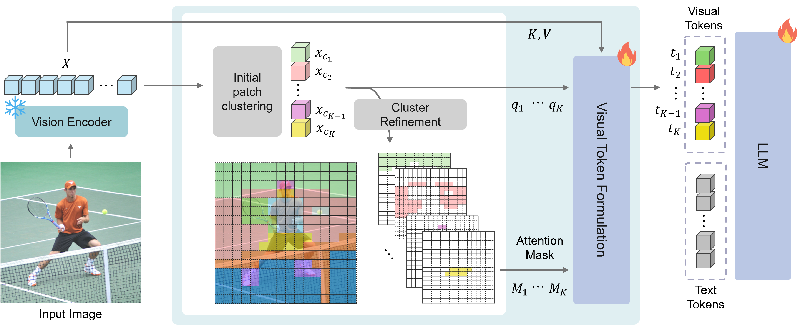
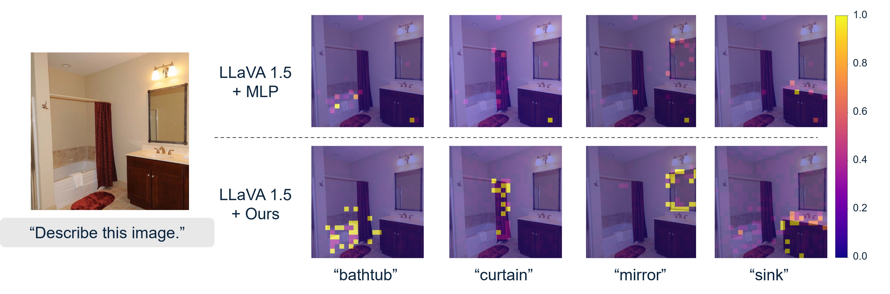

# [CVPR 2026] A More Word-like Image Tokenization for MLLMs

Hyun Lee, Hyemin Jeong, Yejin Kim, Hyungwook Choi, Hyunsoo Cho, Soo Kyung Kim, Joonseok Lee

[](https://arxiv.org/abs/2605.17954)

Official implementation of **DiVT (Disentangled Visual Tokenization)** on top of LLaVA-1.5.

## Overview

Modern MLLMs usually feed images as long sequences of patch-level embeddings, while the language model is optimized for discrete, semantically meaningful tokens. DiVT addresses this mismatch by clustering visual patches into coherent semantic units and projecting them as adaptive visual tokens. This repository provides the DiVT implementation integrated into the standard LLaVA-1.5 training and evaluation pipeline.

### Pipeline Visualization

<p align="center">
  
</p>

## Qualitative Examples

### Semantic Clustering

The clustering result below shows how DiVT groups patches by semantic similarity rather than fixed spatial partitions. The number of groups is decided per image, so visually simple scenes can be represented compactly while complex scenes keep finer structure.

<p align="center">
  
</p>

### Attention Grounding

The attention example illustrates the resulting grounding behavior in generation. Instead of broadly spread attention over many patch tokens, DiVT tends to produce more localized focus aligned with relevant visual concepts.

<p align="center">
  
</p>

## Installation

```bash
git clone https://github.com/LeeHyun98/DiVT.git
cd DiVT

conda create -n DiVT python=3.10 -y
conda activate DiVT

pip install -e .
```

Optional packages:

```bash
pip install -e ".[train]"
pip install flash-attn --no-build-isolation
```

## Data Preparation

Training follows the standard LLaVA-1.5 data setup.

- Pretraining: [LLaVA-Pretrain-558K](https://huggingface.co/datasets/liuhaotian/LLaVA-Pretrain/tree/main)
- Instruction tuning: [LLaVA v1.5 Mix665K](https://huggingface.co/datasets/liuhaotian/LLaVA-Instruct-150K/tree/main)

## Training

### 1) Pretraining

```bash
bash scripts/v1_5/pretrain.sh
```

### 2) Instruction Tuning

```bash
bash scripts/v1_5/finetune.sh
```

Default settings in provided scripts:

- language model: `lmsys/vicuna-7b-v1.5`
- vision tower: `openai/clip-vit-large-patch14-336`
- projector type: `clusterer`
- threshold: `0.65`

## Model Weights

| Model | Avg. Tokens | Checkpoint |
| --- | :---: | --- |
| DiVT0.5 | 35.7 | [hyunlee86/llava-v1.5-7b-divt-0.5](https://huggingface.co/hyunlee86/llava-v1.5-7b-divt-0.5) |
| DiVT0.65 | 74.1 | [hyunlee86/llava-v1.5-7b-divt-0.65](https://huggingface.co/hyunlee86/llava-v1.5-7b-divt-0.65) |
| DiVT0.75 | 136.5 | [hyunlee86/llava-v1.5-7b-divt-0.75](https://huggingface.co/hyunlee86/llava-v1.5-7b-divt-0.75) |

## Evaluation

Example:

```bash
CUDA_VISIBLE_DEVICES=0 bash scripts/v1_5/eval/textvqa.sh
```

To change inference-time tokenization behavior, edit `THRESHOLD` in each evaluation script (or pass `--threshold` manually).

Dataset/evaluation details: `EVAL.md`.

## Citation

```bibtex
@inproceedings{lee2026divt,
  title={A More Word-like Image Tokenization for MLLMs},
  author={Lee, Hyun and Jeong, Hyemin and Kim, Yejin and Choi, Hyungwook and Cho, Hyunsoo and Kim, Soo Kyung and Lee, Joonseok},
  booktitle={Proceedings of the IEEE/CVF Conference on Computer Vision and Pattern Recognition},
  year={2026}
}
```

## License

This project is released under the [Apache 2.0 license](LICENSE).

## Acknowledgement

DiVT is built upon [LLaVA](https://llava-vl.github.io/) and [TokenPacker](https://github.com/CircleRadon/TokenPacker).
